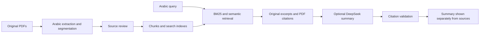

<div align="center">

# رُؤيا · Ru’ya RAG

**Explore historical Arabic dream texts through their original sources.**

An Arabic-first retrieval-augmented generation application with searchable passages,
PDF citations, and optional AI summaries grounded in reviewed excerpts.

**Next.js · FastAPI · Sentence Transformers · FAISS · BM25**

[Getting started](#getting-started) · [Using the app](#using-the-app) · [API](#api-examples) · [Documentation](#documentation)

</div>

---

## About the project

Ru’ya RAG connects Arabic queries to passages from historical books on dream
interpretation. Each result includes its source, author, review status, and a link
to the original PDF page. Optional AI-generated summaries appear separately from
the quoted text and must pass citation checks before being displayed.

The project brings together Arabic document extraction, source review, hybrid
retrieval, and a complete web interface. It is currently a **local research
application with limited reviewed coverage**, not a finished digital edition.
Historical interpretations are presented as historical texts—not predictions,
verified facts, or definitive religious rulings.

## Features

- **Arabic RTL interface** with light/dark themes and responsive layouts.
- **Three search modes:** keyword search with BM25, semantic search with multilingual
  embeddings, and hybrid search combining both rankings.
- **Traceable evidence:** book and author metadata, original passages, review scope,
  and links to physical PDF pages.
- **Optional AI summaries:** DeepSeek synthesis with checked source IDs and exact
  quotations. Retrieval works without a provider key.
- **Transparent library:** separate counts for extracted candidates, complete
  reviewed passages, reviewed excerpts, and indexed chunks.
- **Inspection and evaluation:** book/chapter filters, retrieval details, corpus
  quality reports, and a dashboard with measured retrieval metrics.

### How it works



Extraction does not automatically approve a passage. The default search collection
uses reviewed text; a separate experimental collection is opt-in and never supplies
AI generation. Citation validation checks attribution mechanically; it does not
prove that every generated interpretation follows from its evidence.

## Source collection

Current snapshot: **31 complete reviewed passages, 6 reviewed excerpts, and
39 reviewed search chunks** across two searchable books.

| Book | Author / attribution | Extracted candidates | Complete reviewed passages | Reviewed excerpts |
| --- | --- | ---: | ---: | ---: |
| تعطير الأنام في تعبير المنام | عبد الغني النابلسي | 2,455 | 24 | 6 |
| الإشارات في علم العبارات | ابن شاهين الظاهري | 319 | 7 | 0 |
| منتخب الكلام في تفسير الأحلام | Attributed to Ibn Sirin; attribution uncertain | 0 | 0 | 0 |

Reviews are recorded as **AI-assisted visual comparisons with the original PDFs**,
not independent scholarly approval. An approved excerpt does not approve its whole
parent passage. Ibn Sirin's scanned edition still needs OCR and review.

See the [latest corpus review report](docs/corpus-batch-01.md) for evidence,
known extraction defects, and remaining work. The running library displays counts
from the selected corpus artifacts.

## Getting started

### 1. Install dependencies

Requirements: **Python 3.12+**, **Node.js 22+**, and npm. The commands below use a
Bash-compatible shell and run from the repository root after cloning it.
A GPU is not required; embedding and retrieval use the CPU.

```bash
cd Ruya-RAG
python3 -m venv .venv
.venv/bin/python -m pip install -r requirements.txt
npm --prefix frontend ci

# Create local configuration without overwriting an existing file.
test -f .env || cp .env.example .env
```

Leave `RUYA_ENABLE_GENERATION=false` for a local retrieval-only setup. No DeepSeek
key is needed to search prepared indexes.

### 2. Prepare the corpus files

> **Fresh clone:** PDFs, generated ingestion/review runs, and FAISS indexes are
> excluded from Git. The repository contains code, review ledgers, and manifests,
> but does not currently include a downloadable prepared corpus or a one-command
> fresh-clone bootstrap. Installing dependencies alone does not make search ready.

For an existing prepared workspace, keep these files and directories in place:

| Location | Required contents |
| --- | --- |
| `data/raw/` | `nabulsi.pdf`, `ibn-Shahin.pdf`, `ibn-sirine.pdf` |
| `data/processed/ingestion/` | Candidate run selected by `storage/manifests/phase2-handoff.json` |
| `data/processed/reviewed/` | Reviewed run selected by the same manifest |
| `storage/indexes/` | Indexes selected by `storage/manifests/phase3-handoff.json` |
| `data/evaluation/` | Selected review ledgers and evaluation reports |

Restore a matching set of your own artifacts, or prepare them using the workflow
below. Renaming a different PDF to a catalog filename does not make it the same
edition: source checksums and review decisions must match.

<details>
<summary><strong>Preparing a new corpus or rebuilding artifacts</strong></summary>

1. Place the original source PDFs in `data/raw/`, then extract candidates:

   ```bash
   .venv/bin/python scripts/ingest.py all
   ```

   The command prints an immutable run directory. Inspect its `report.json`,
   `passages.jsonl`, and `review_queue.jsonl`. Successful extraction is not review.

2. Compare complete passages and boundaries with the PDFs and record source-bound
   decisions as described in the [review guide](docs/ingestion.md). Replace the
   example run ID and decision-file path below with your actual values:

   ```bash
   .venv/bin/python scripts/review.py \
     --run data/processed/ingestion/CANDIDATE_RUN_ID \
     --decisions /path/to/review-decisions.json \
     --output-root data/processed/reviewed
   ```

   Existing ledgers can only be reused when their run IDs, source checksums, and
   text checksums match. Changed text requires fresh review.

3. Select the candidate and reviewed run paths and their `manifest.json` SHA-256
   hashes in `storage/manifests/phase2-handoff.json`. Its excerpt ledger, if used,
   must also match the selected passages and recorded checksum. Selection is
   currently manual; the scripts do not update active handoffs for you.

4. Build the reviewed index. On the first build, explicitly allow downloading the
   pinned multilingual embedding model:

   ```bash
   .venv/bin/python scripts/build_index.py --download-model
   # Optional experimental index; subsequent builds use the local model cache.
   .venv/bin/python scripts/build_index.py --policy experimental
   ```

5. Evaluate the new indexes using source-reviewed relevance judgments compatible
   with your corpus. Select the printed index paths, their manifest SHA-256 hashes,
   and matching evaluation paths in `storage/manifests/phase3-handoff.json`.
   Both indexes must reference the selected reviewed manifest. See
   [retrieval and index compatibility](docs/retrieval.md).

Keep previous runs intact and restart the backend after changing active handoffs.
The build commands require an eligible reviewed corpus; downloading a model does
not replace missing source data or reviews.

</details>

### 3. Start the application

**Terminal 1 — backend**

```bash
.venv/bin/python -m uvicorn backend.app.main:app \
  --host 127.0.0.1 --port 8000 --no-access-log
```

**Terminal 2 — frontend**

```bash
npm --prefix frontend run dev
```

| Service | Address |
| --- | --- |
| Web application | http://127.0.0.1:3000 |
| Interactive API documentation | http://127.0.0.1:8000/docs |
| Backend health | http://127.0.0.1:8000/health |

Check readiness with `curl http://127.0.0.1:8000/health`. The response must contain
`"ready": true` for corpus endpoints to work; HTTP 200 alone is not a readiness check.
Missing or incompatible artifacts leave the backend running in a degraded state.

For a local production build of the frontend:

```bash
npm --prefix frontend run build
npm --prefix frontend run start
```

## Using the app

1. Open the home page and enter an Arabic symbol or description. Start with a
   reviewed example such as `يعسوب`, `حصير`, or `رأيت السراب في المنام`.
2. Choose **BM25**, **dense**, or **hybrid** search under the reading options.
   Leave AI generation unchecked to read original evidence only.
3. Inspect the excerpts, review badges, and PDF citations. Expand the original
   passage details to see the surrounding source metadata.
4. Use **Search** to filter by book or exact chapter title, **Library** to check
   coverage, and **Dashboard** to inspect corpus and evaluation statistics.

A longer regression example is:

> رأيت في المنام أنني أسافر في سفينة وسط البحر، وكانت الأمواج عالية، لكنني وصلت إلى الشاطئ بسلام.

The app can retrieve reviewed excerpts for individual symbols in this description.
That does not establish a combined interpretation of the entire dream. Empty
results mean the reviewed collection may not cover the query.

### Optional AI generation

Edit the root `.env` locally:

```dotenv
DEEPSEEK_API_KEY=your_key_here
RUYA_ENABLE_GENERATION=true
```

Restart the backend, then explicitly enable generation in the interface. This sends
the query and selected excerpts to DeepSeek and may incur provider charges. Keep
keys server-side; never commit `.env` or put secrets in `NEXT_PUBLIC_*` variables.
If generation fails or citation validation rejects the answer, source excerpts
remain available.

| Setting | Default / purpose |
| --- | --- |
| `RUYA_ENABLE_GENERATION` | `false`; requires a provider key as well |
| `RUYA_ALLOW_EXPERIMENTAL_SEARCH` | `false`; opt-in unreviewed-candidate search |
| `RUYA_CORS_ORIGINS` | Local frontend origins on port 3000 |
| `RUYA_MAX_OUTPUT_TOKENS` | `900`; generation output budget |
| `NEXT_PUBLIC_API_URL` | Frontend API address; defaults to `http://127.0.0.1:8000` |

Backend settings live in the root `.env`. Set `NEXT_PUBLIC_API_URL` in
`frontend/.env.local` when changing the API address; restart or rebuild the frontend
and update backend CORS origins when needed. See [.env.example](.env.example) and
[backend configuration](docs/backend.md) for all supported settings.

## API examples

Search the reviewed collection without calling a generation provider:

```bash
curl http://127.0.0.1:8000/api/search \
  -H 'Content-Type: application/json' \
  -d '{"query":"رأيت السراب في المنام","mode":"bm25","book_id":"ibn-Shahin","top_k":5}'
```

Retrieve interpretation evidence with generation explicitly disabled:

```bash
curl http://127.0.0.1:8000/api/interpret \
  -H 'Content-Type: application/json' \
  -d '{"query":"رأيت حصير في المنام","mode":"hybrid","generate":false}'
```

Other useful endpoints include `GET /api/books`, `GET /api/stats`, and
`GET /api/passages/{passage_id}`. The [API guide](docs/backend.md) documents response
states, filters, limits, and errors. Scores are ranking signals, not confidence
percentages. PDF page links use physical PDF page numbers.

## Development and tests

```bash
# Backend: uses local source files, corpus artifacts, and the cached model.
.venv/bin/python -m unittest discover -s backend/tests -v

# Frontend checks.
npm --prefix frontend run typecheck
npm --prefix frontend run format:check

# Browser tests: install Chromium once, then run.
(cd frontend && npx playwright install chromium)
npm --prefix frontend run test:e2e
```

The full backend suite also requires preserved historical data used by the archive
regression tests; it is not a data-free fresh-clone test suite. Browser tests build
into `.next-e2e/` and use isolated ports **13000 / 18000**, with generation disabled.
Provider tests use fixtures and make no paid API calls.

The latest corpus batch passed **64 backend tests** and all **10 browser cases**
after correcting an outdated single-book test assumption. The 14-query retrieval
set is a regression smoke test, not an independent quality benchmark. See the
[validation report](docs/corpus-batch-01.md).

### Troubleshooting

| Symptom | What to check |
| --- | --- |
| Backend runs, but `ready` is false | Restore the runs/indexes referenced by the active handoffs and check their hashes. Inspect backend startup output. |
| Library still shows old counts | Restart the backend after changing corpus handoffs, then refresh the page. |
| Dense search falls back to BM25 | Cache the pinned model through `build_index.py --download-model` once the reviewed corpus is prepared. Serving does not download models automatically. |
| No evidence for a query | Check library coverage, try a reviewed symbol, and clear book/chapter filters. |
| Generation is unavailable | Check the server-side key and generation setting, restart the backend, and enable it in the UI. |
| Frontend cannot reach the API | Check the backend address, `NEXT_PUBLIC_API_URL`, and `RUYA_CORS_ORIGINS`. |
| Browser-test ports are occupied | Set `RUYA_E2E_WEB_PORT` and `RUYA_E2E_API_PORT` to unused ports. |

## Project structure

```text
backend/app/
├── rag/                 # Ingestion, chunking, embeddings, retrieval, generation, evaluation
├── services/            # Corpus access and interpretation orchestration
├── schemas/             # API request and response contracts
└── main.py              # FastAPI application
backend/tests/           # Unit, integration, provenance, and regression checks
frontend/                # Next.js Arabic RTL application and browser tests
scripts/                 # Ingest, review, build, search, and evaluate commands
data/                    # Source files, generated runs, and review/evaluation ledgers
storage/                 # Indexes, active handoffs, and inspection artifacts
docs/                    # Architecture, setup, source review, and implementation reports
archive/previous_lessons/ # Preserved learning exercises and the original pipeline
```

## Roadmap

- [x] Arabic PDF ingestion with source coordinates and review records
- [x] Reviewed and experimental retrieval collections
- [x] FastAPI backend with optional citation-checked generation
- [x] Arabic RTL web interface and automated browser coverage
- [ ] Broader source review and repair of remaining extraction defects
- [ ] OCR and review for the scanned Ibn Sirin edition
- [ ] Larger, independently reviewed retrieval and answer-quality evaluation
- [ ] Docker packaging and deployment preparation

The current server binds locally and has no authentication. Public deployment
requires additional access controls and shared usage budgets. Corpus preparation
continues before the planned packaging phase.

## Documentation

| Guide | Contents |
| --- | --- |
| [Architecture](docs/architecture.md) | Components and data flow |
| [Ingestion and source review](docs/ingestion.md) | Extraction, quality flags, review decisions, and immutable runs |
| [Retrieval](docs/retrieval.md) | Chunking, search modes, CLI usage, and index compatibility |
| [Backend](docs/backend.md) | API reference and configuration |
| [Frontend](docs/frontend.md) | Web application setup and browser checks |
| [Generation](docs/generation.md) | Source grounding, validation, and generation limits |
| [Latest corpus review](docs/corpus-batch-01.md) | Current coverage, review evidence, and validation results |
| [Learning guide](docs/learning-guide.md) | Implementation walkthrough and archived lessons |

Contributions to Arabic extraction, source review, retrieval evaluation, and
accessibility are welcome. When reporting a source-text issue, include the book,
physical PDF page, passage ID when available, and the observed discrepancy so it
can be checked against the original edition.
